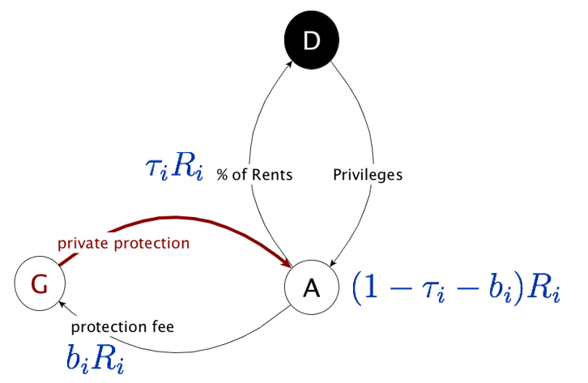
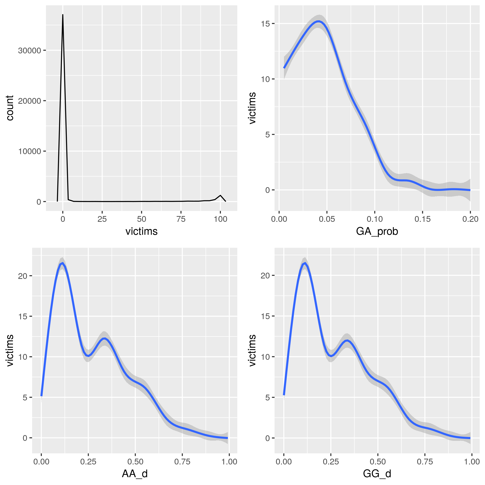

# cronyNets

This repository includes code and replication instructions for my research article "[Network structure and performance of crony capitalism systems](https://rdcu.be/cdb0x)" forthcoming in *[Public Choice](https://link.springer.com/journal/11127/volumes-and-issues)*.




## Contents
* [Code](#code)
* [Simulation](#simulation)
* [Replication](#replication)
* [License and Citation](#license)

## <a name="code"> Code

The [src](src) directory includes five separate files with R functions, which are documented in the included [manual](builds/cronyNets_1.0.pdf).

The easiest way to use these files is to install the cronyNets package located in the builds folder.  See  [installation instructions for R packages](https://www.rdocumentation.org/packages/utils/versions/3.4.0/topics/install.packages).


Alternatively, you can import these functions into a current R session:

```
source("src/cronyNets_Simulations.R")
source("src/cronyNets_SocietySetup.R")
source("src/cronyNets_NetworkStructures.R")
source("src/cronyNets_AttackSetup.R")
source("src/cronyNets_AttackSummary.R")
```
If you import these files, please make sure to meet these dependencies in advance:  R (>= 3.1.0) , network, sna, parallel, doParallel, foreach, and iterators.


## <a name="simulation"> How to simulate predation

The main function to simulate predation attacks is **cronyNets()**

```
sim1 <- cronyNets(params.GRID, reps = 50)
```

The first argument *params.GRID* is a data frame created by this utility function:

```
societyParamsGrid <- function(numA, numG, ptie.max, 
                              Cd = 100, rho.base = 1, 
                              attack.mode = "rnd", attack.N = "single", 
                              ptie.mode = "rnd", exog = 1, saveFile="simParams") 
```

You can use the function *cronysimple()* to see the output from a single simulation that only requires the number of participants and a probability of G-A ties (e.g., 100 asset holders and 50 private enforcers with an affiliation probability of 0.05:

```
sim1 <- cronysimple(100,50,0.05) 
```

## <a name="replication"> Replication


The replicate folder includes three scripts to regenerate data and statistical analysis:

* societyParameters.R:  This file creates a data frame with simulation parameters for 40,000 configurations that are saved in the data/paramsGrid.RData file
* predationSimulations.R: This file runs predation simulation on paramsGrid.RData configurations that generated the anaytic dataset in data/simData.RData
* networkAnalysis.R: this file estimates three statistical models, which are saved in the analysis directory as crony_net.RData




Note: simulations for this article were performed on a desktop computer running Ubuntu 18.04 LTS with an Intel(R) Xeon(R) CPU E5-2687W v2 @ 3.40GHz.  The code relies heavily on a parallelized routine using the *foreach* package to use all available cores. To expedite simulations, you will need at least 16G RAM and Intel MKL for parallel mathematical computing.    

## <a name="license"> License and Citation

Simulation code is made available as open source without warranties under an [MIT License](LICENSE).  If you use this code, either directly to modify for your own projects or to inspire an independent project, please use this citation:

> Razo, Armando (2020), cronyNets: crony capitalism network simulations. R package version 1.0.  URL=https://github.com/arazoNet/cronyNets.
  
